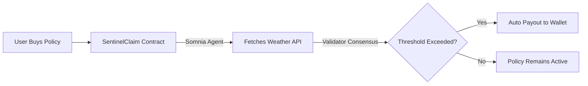

# SentinelClaim
Autonomous Parametric Micro-Insurance | Somnia Agentathon 2026

SentinelClaim is a decentralized, fully autonomous parametric insurance protocol that removes human adjusters from the loop. Built exclusively for the Somnia Network, it allows users to deposit STT to buy micro-policies against weather events. The smart contract utilizes Somnia Agents to natively fetch weather data from offchain APIs, and upon validation, triggers instant payouts with zero offchain infrastructure or oracle intermediaries.

## Architecture



## Somnia Features Used
- **Somnia Agents (IAgentRequester):** The contract invokes onchain agents to fetch live weather data from OpenWeatherMap API. No Chainlink, no external oracles, no keeper bots.
- **Deployed on Somnia Testnet** (Chain ID: 50312)

## Why This Cannot Exist on Other Chains
On Ethereum/Polygon/Arbitrum/Solana, a smart contract cannot call an external API. It relies on oracle networks (Chainlink, Pyth) that add cost, latency, and centralization. SentinelClaim's entire value proposition depends on **Somnia Agents** making smart contracts internet-native.

## Quick Start

```bash
# Clone the repository
git clone https://github.com/daksh777f/sentinel-claim.git
cd sentinel-claim

# Install dependencies (root and frontend)
npm install
cd frontend && npm install
cd ..

# Compile contracts
npm run compile

# Run tests
npm run test

# Run frontend dev server
npm run dev
```

## Environment Variables
Create a `.env` file in the root directory and configure the following variables:

| Variable | Description |
|----------|-------------|
| `PRIVATE_KEY` | Your wallet private key for deployment |
| `API_KEY` | OpenWeatherMap API Key (used by Agents) |
| `SOMNIA_EXPLORER_API_KEY` | API key for Somnia block explorer verification |

## Deployed Addresses (Testnet)
- **SentinelClaim:** [0x85F6e96b92776b0aAd00287BFBaB86eFeDBC9625](https://shannon-explorer.somnia.network/address/0x85F6e96b92776b0aAd00287BFBaB86eFeDBC9625)

## Tech Stack
- **Smart Contracts:** Solidity 0.8.30, Hardhat
- **Reactivity:** Somnia Agent Requester
- **Frontend:** React 18, Vite, Tailwind CSS, ethers.js v6

## License
MIT
